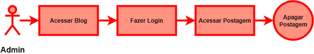

# Trabalho de Back End (Univassouras)

Trabalho realizado para a matéria de Back End da Univassouras, usando Java e Django.
O tema escolhido pelo grupo foi criar um **BLOG**.

 

## Descrição:

* Até 4 pessoas por grupo.
* Simulação de equipe de desenvolvimento.
* Uso do Trello para gestão (opcional).
* Uso obrigatório do GitHub.
* Parte 1: Documentação com diagramas (ER, Casos de Uso, Classes, Fluxogramas).
* Parte 2: Implementação do código com Python + Django e Banco de Dados.
* Entrega em GitHub com breve documentação e apresentação prática.

 

## Grupo:

* [Leandro Lima Cardoso](https://github.com/Leandro-Cardoso)
* [Igor da Silva](https://github.com/igorcardiias)
* [Laura Gomes](https://github.com/Laurarpgk0)
* [Karlos Eduardo](https://github.com/Kadusquin)

 

## Diagramas de **Classe** e de **Relacionamento**:

 

Essa imagem descreve a estrutura de cada Classe ou Entidade do banco de dados e o seu relacionamento.

## Diagramas de **Casos de Uso**:

 

Essa imagem descreve os casos de uso para cada um dos dois tipos de usuário do nosso sistema.

 

## Outros Diagramas:

 

### Comentar postagens:

    

### Criar postagem:

    

### Editar postagem:

    

### Apagar postagem:

    

 

## Documento de Requisitos – Blog em Django

 

### 1. **Introdução:**

O sistema será um blog desenvolvido em Python
(Django).
Ele permitirá criar e gerenciar postagens organizadas
por categorias, além de permitir comentários de
usuários.
Também terá controle de acesso por papéis
(administrador, autor e leitor).

 

### 2. **Escopo:**

• Frontend: Django Templates (HTML, CSS,
JS) ou integração com frameworks de JavaScript.

• Backend: Django (ORM, Views, Forms) e
opção de API com Django REST Framework.

• Banco de Dados: PostgreSQL (preferido) e
SQLite para desenvolvimento.

• Autenticação: Sistema nativo do Django,
com usuário personalizado.

• Implantação: Windows

 

### 3. **Requisitos Funcionais:**

#### 3.1. **Usuários:**

• Cadastro de usuários com papéis (admin,
autor, leitor).

• Login e logout seguros.

• Permissões diferentes por papel.

• Apenas administradores podem gerenciar
usuários.

#### 3.2. **Postagens:**

• Criadas por autores e administradores.

• Devem ter título, conteúdo, autor, categorias
e data.

• Somente o autor ou um admin pode
editar/excluir.

• Filtragem por autor, categoria ou data.

• Exibição em ordem cronológica inversa
(mais recentes primeiro).

#### 3.3. **Categorias:**

• Cadastro e gerenciamento de categorias.

• Postagens podem ter várias categorias.

• Apenas administradores podem editar ou
excluir.

#### 3.4. **Comentários:**

• Apenas usuários logados podem comentar.

• Cada comentário terá autor e estará ligado a
uma postagem.

• Exibidos em ordem de publicação.

• Somente o autor do comentário ou admin
pode editar/excluir.

#### 3.5. **Administração:**

• Uso do painel de administração do Django.

• Estatísticas: postagens mais comentadas,
usuários mais ativos etc.

 

### 4. **Requisitos Não Funcionais:**

#### 4.1. **Desempenho:**

• Consultas otimizadas para não
sobrecarregar o banco.

• Páginas devem carregar em até 2 segundos
em uso normal.

#### 4.2. **Segurança:**

• Senhas criptografadas.

• Proteção contra CSRF.

• Uso de HTTPS.

• Controle de acesso por papéis.

#### 4.3. **Disponibilidade:**

• Disponibilidade mínima de 99,5%.

• Backup diário automático do banco.

#### 4.4. **Usabilidade:**

• Interface responsiva (celular e desktop).

• Mensagens claras em erros ou ações
importantes (ex.: login errado, exclusão).

#### 4.5. **Manutenção:**

• Código seguindo boas práticas (PEP8).

• Testes automatizados (unidade e
integração).

• Documentação da API e do modelo de
dados.

#### 4.6. **Escalabilidade:**

• Suporte a rodar em vários servidores.

• Uso de cache para melhorar o desempenho.
